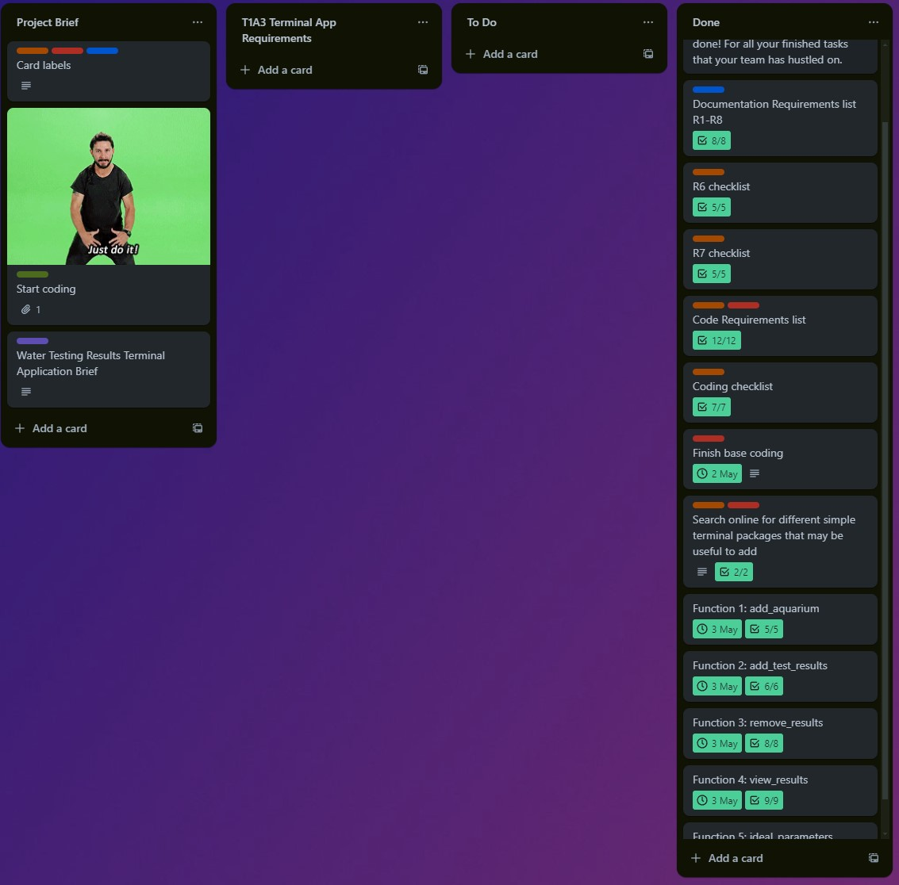
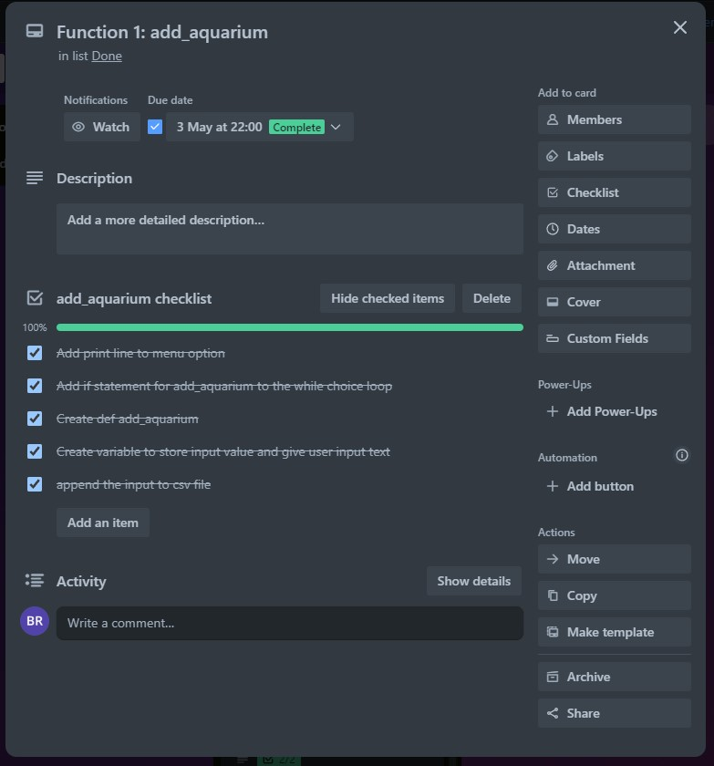
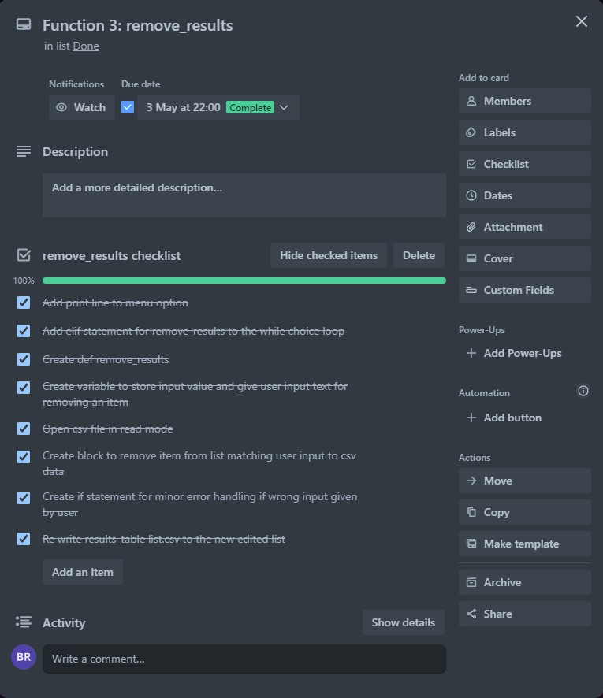
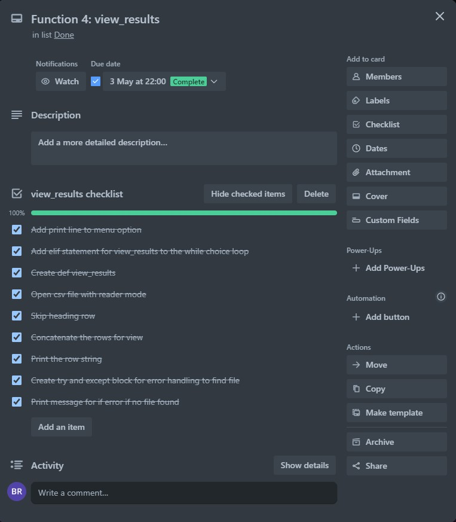
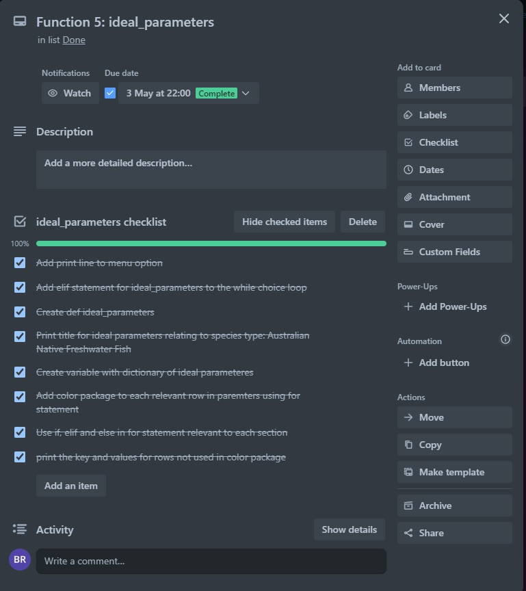

# T1A3_Terminal_Application
## Bradley Richmond - Aquarium Water Testing Application


## Documentation:

## R3. Provide full attribution to referenced sources (where applicable)
- Colored Package - dslackw. “Colored: Simple Library for Color and Formatting to Terminal.” PyPI, https://pypi.org/project/colored/

- Rich package - McGugan, Will. “Rich: Render Rich Text, Tables, Progress Bars, Syntax Highlighting, Markdown and More to the Terminal.” PyPI, https://pypi.org/project/rich/

- PEP8 style guide - van Rossum, Guido, et al. “PEP 8 – Style Guide for Python Code.” Peps.python.org, 5 July 2001, https://peps.python.org/pep-0008/


## R4. Provide a link to your source control repository
- Link to T1A3 Terminal Application: https://github.com/bradx32/T1A3_Terminal_Application


## R5. Identify any code style guide or styling conventions that the application will adhere to.

### [PEP8](https://peps.python.org/pep-0008/) Style guide is used in the water testing application.
- 4 spaces per indendation level used for all code.
- Snack case (snake_case), used for naming conventions
- UPPER_CASE used for constants in the code such as 'FILE_NAME'


## R6. Develop a list of features that will be included in the application. It must include:

### Features
#### 1. Aquarium Water Testing Results Management: 
-  My application allows users to manage aquarium water testing results, including naming their aquarium, adding test results, removing results, viewing results, and checking ideal aquarium parameters.


#### 2. Menu interface feature: (Variables, Variable scope, Loops and conditional control structures)
- The user interacts with the application through a menu driven interface where they can select options corresponding to different functionalities. Each of these menu options pass as a "feature", as they apply a unique function of the app. See explanations below.

For example: Menu interface features

```
1. Enter 1 to name your Aquarium
2. Enter 2 to add test results to your Aquarium
2. Enter 3 to remove item from the results list
4. Enter 4 to view water testing results
5. Enter 5 to check ideal Aquarium parameters
5. Enter 6 to exit application
```

From 'water_testing_app.py', identifiying a variable.

```
FILE_NAME = "results_table.csv"
```

- This is the set variable for the .csv file which is used in the function of each add_aquarium, add_test_results, remove_results, view_results and ideal_parameters.

From menu_functions.py
```
def add_aquarium(FILE_NAME):
    results_name = input("Enter Aquarium name: ")
    with open(FILE_NAME, "a") as f:
        writer = csv.writer(f)
        writer.writerow([results_name])
```
- The FILE_NAME variable is the parameter for the add_aquarium function, used within the function to specify which file to work with. 
- The results_name is declared inside of the add_aquarium function which means it can only be used within this function (variable scope).

See the functions loop below for the menu options of the application. Loops and conditional control structures

```
# Functions loop
while choice != "6":
    choice = create_menu()

    if (choice == "1"):
        add_aquarium(FILE_NAME)
        
    elif (choice == "2"):
        add_test_results(FILE_NAME)

    elif (choice == "3"):
        remove_results(FILE_NAME)

    elif (choice == "4"):
        view_results(FILE_NAME)
    
    elif(choice == "5"):
        ideal_parameters(FILE_NAME)

    elif (choice == "6"):
        print("You entered 6.")
    else:
        print("Please only enter the options shown above.")


# Prints on termination "6" at end of application
print("Thank you for using the Water Testing application")

```
- The above code shows the while loop which ensures the menu is displayed and the users input is repeatedly processed until the user chooses to exit the application (choice 6). This loop is very important as it ensures the user comes back to the menu after using each function (excluding choice 6).
- The if, elif and else control structures in the loop are used to determine which action to take based on the menu selection. The 'if' checks if the user has selected option 1 from the menu, 'elif' for each option 2, 3, 4, 5 and 6 to check if user enters these options and finally 'else' provides a default 'print' that will display if the user enters any value that does not match the declared 'if' and 'elif' options.
- The else statement also provides a very basic form of error handling, as the application will show a "Please only enter the options shown above." message if no matching value is entered. Without the else statement the loop will still run, although it provides more information to the user.

### Error handling

- 'remove_results' function provides feedback to the user if the user inputs a value to remove that does not match a result/value in the results_table.csv file.
- else statement from the functions loop 
```
else:
        print("Please only enter the options shown above.")
```

- 'try' and 'except' to view results from the .csv file. See explanation below


```
def view_results(FILE_NAME):
    try:
        with open(FILE_NAME, "r") as f: 
            reader = csv.reader(f)
            reader.__next__()
            for row in reader:
                # Concatenate the elements of each row into a single string
                row_string = "".join(row)
                # Print the formatted row
                print(row_string)
    except FileNotFoundError:
        print("The results table doesn't exist")
```
- The above code has a try and except block which will result in the message "The results table doesn't exist" if the file is not found.
- The 'try' block raises an exception and the 'except' block catches the exception and executes the print code within it. 


#### 3. File Handling feature:
- The application handles file operations, such as creating a CSV file to store aquarium names and results if it doesn't exist, and reading/writing data to this file to store and retrieve information.

```
# if the file does not exist
if (not os.path.isfile(FILE_NAME)):
    # Display message if file does not exist, gives user more information.
    print("A list file was created as it did not exist, this will store your Aquarium name and results")
    # Create the file
    aquarium_name_file = open(FILE_NAME, "w")
    # Enter the headings into the file
    aquarium_name_file.write("Aquarium Name & Test Results\n")
    # Close the file
    aquarium_name_file.close()
```

#### 4. Text Styling with packages feature: 
- The use of external packages like rich and colored has given the option for text styling, including colors and formatting, this enhances the visual look of the application, making it more pleasing to interact with. The option 5 'check ideal Aquarium parameters', shows a list of parameters with corresponding background colour to each test result, which is how the water test colour will appear in testing according to the 'Freshwater Master Test Kit' guidelines.


### R7. Develop an implementation plan which:

## [Trello board](https://trello.com/b/LhNt6Gmr/terminal-application) 

### Overall Trello board



### Function 1


### Function 2


### Function 3


### Function 4


### Function 5



### R8. Design help documentation which includes a set of instructions which accurately describe how to use and install the application.

## Help Documentation 

See the [help_documentation.md](help_documentation.md) file for instructions on how to install and use the application

## Installing Application:
- Open your terminal
- python3 --version (check your version)
    - If not installed, download from [official website](https://www.python.org/downloads/)
- Navigate to application directory
- Execute the ./run.sh provided which should then run the following
    - Sets up a virtual environment .venv.
    - Activates the virtual environment.
    - Installs required Python packages (colored and Rich) using pip3.
    - Runs the water_testing_app.py application.
    

## Dependencies Required:
- Colored 2.2.4
- Rich

## System Requirements:
- Windows/Linux/MacOS
- Python version 3.10.12 used on this application. Although only Python 3.9 and above is required.  
<br>
<br>

# Thank you for using the Water Testing Application!