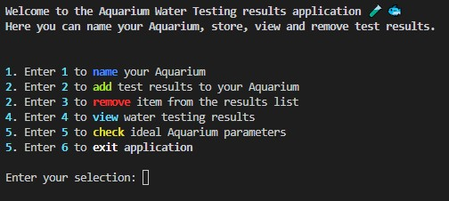
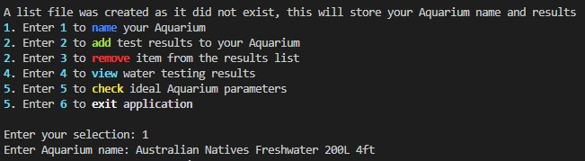
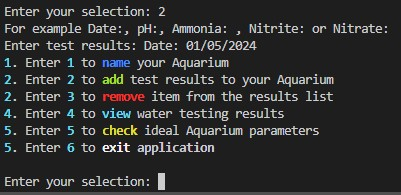
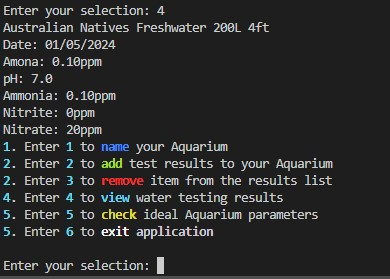
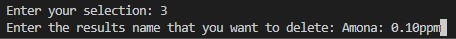
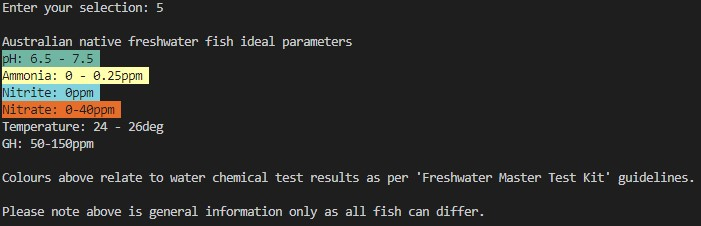
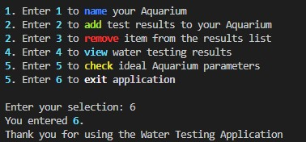

# Help Documentation

## Installing Application:
- Open your terminal
- python3 --version (check your version)
    - If not installed, download from [official website](https://www.python.org/downloads/)
- Navigate to application directory
- Execute the ./run.sh provided which should then run the following
    - Sets up a virtual environment .venv.
    - Activates the virtual environment.
    - Installs required Python packages (colored and Rich) using pip3.
    - Runs the water_testing_app.py application.
    

## Dependencies Required:
- Colored 2.2.4
- Rich

## System Requirements:
- Windows/Linux/MacOS
- Python version 3.10.12 used on this application. Although only Python 3.9 and above is required.

## How to use the application

#### Once the file is run you will be met with the following message and menu options:



- At the beginning of the program, a message may display due to the results_table.csv file not being found.
    - The .csv will be created and the below message will be displayed. This is where your input data is stored.

```
A list file was created as it did not exist, this will store your Aquarium name and results
```
## Name your Aquarium (Enter "1")
- You can now enter '1' to input your Aquarium name, for example:



## Adding results (Enter "2")
- Now that your aquarium has a name, you can add test results to your aquarium via entering '2'.
    - Remember to enter '2' each time you enter a new line of results
    - Example test results are also printed to give an idea of what data to input and standard test results, Date:, pH:, Ammonia: , Nitrite: or Nitrate: .



## View results (Enter "4")
- To view your input name and results, use the view function by entering "4".
    - See example below where multiple test results have been added



- You may notice an input mistake made with the "Amona: 0.10ppm" results. This can be removed in the next step.

## Removing results (Enter "3")
- To remove a test result you can enter "3" and type in the exact data input you would like to remove. See example
    - The result I want to remove as seen in the view results section "Amona: 0.10ppm", removed by entering:



## Check Ideal Aquarium Parameters (Enter "5")
- To check the ideal aquarium parameters, enter the option "5" which will provide information to the user on ideal water conditions for Australian Native Freshwater fish. Options for specific fish species parameters may be added in future.



- The colours displayed for each test correspond with the "Freshwater Master Test Kit" guidelines for the test range.

## Exiting the application (Enter "6")
- Enter "6" to exit the application



## Thank you for using the water testing application!